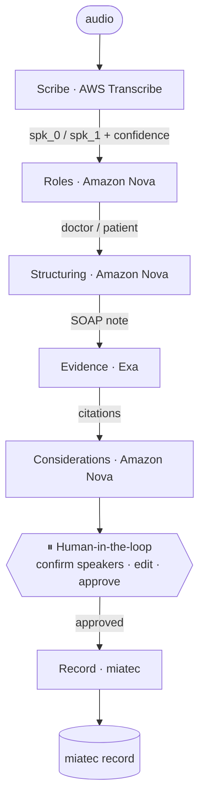

# miatec copilot

**The doctor just talks.** A team of agents transcribes the consultation, attributes each turn to
doctor or patient, structures it into a clinical note, grounds it in real evidence, ranks differential
considerations, pauses for the doctor to approve — then writes the finished record into **miatec**.

Built for the **NEXT Hackathon**. The bet: this rubric scores your *agents* — legible orchestration, a
real human-in-the-loop gate, real tool use (real APIs taking real actions), and explicit failure
handling. See [`NEXT_Hackathon_Build_Plan.md`](./NEXT_Hackathon_Build_Plan.md) for the runbook,
[`docs/INTEGRATIONS.md`](docs/INTEGRATIONS.md) for the live stack, and
[`docs/SPEAKER_ATTRIBUTION.md`](docs/SPEAKER_ATTRIBUTION.md) for the speaker-roles design.

> ⚕️ Decision **support**, not autonomous diagnosis. The agents draft and rank; the clinician edits,
> approves, and owns every write into miatec.

---

## The loop

1. **Scribe** transcribes the consultation — diarized (spk_0 / spk_1), with per-segment confidence.
2. **Roles** attributes each speaker to **doctor or patient** — a reasoned step with a confidence score.
3. **Structuring** turns the role-labeled transcript into a validated SOAP note.
4. **Evidence** grounds it with cited guidelines/literature (Exa).
5. **Considerations** ranks differential considerations with rationale + evidence links.
6. **⏸ Human-in-the-loop** — the doctor confirms speakers, edits, dismisses, approves.
7. **Record** writes the approved note into miatec.

## Architecture



| Agent | Job | Real tool/API | Scores under |
|---|---|---|---|
| **Scribe** | audio → diarized transcript w/ confidence | AWS Transcribe (pt-BR) | Actions & Tool Use |
| **Roles** | diarized speakers → doctor/patient + confidence | Amazon Nova (Bedrock) | Autonomy + Failure Handling |
| **Structuring** | transcript → validated SOAP JSON | Amazon Nova (Bedrock) | Autonomy & Decision-Making |
| **Evidence** | symptoms → cited guidelines | **Exa** | Tool Use + Exa prize |
| **Considerations** | note + evidence → ranked differentials | Amazon Nova (Bedrock) | Autonomy & Decision-Making |
| **Record** | approved note → into miatec | **miatec** | Actions & Tool Use — *the moat* |
| **Orchestrator** | order, state, HITL gates, failures | LangGraph | Orchestration + Failure Handling |

> **LLM note:** Roles / Structuring / Considerations run on **Amazon Nova** via Bedrock (the workshop
> AWS account allows Amazon models; third-party Bedrock models are blocked). Setting `ANTHROPIC_API_KEY`
> transparently upgrades them to **Claude** via the Anthropic API. Details in [`docs/INTEGRATIONS.md`](docs/INTEGRATIONS.md).

## Repo layout

```
.
├── backend/            FastAPI + LangGraph — agent orchestration + REST/SSE API
│   └── app/
│       ├── agents/     one file per agent: scribe, roles, structuring, evidence, considerations, record
│       ├── graph.py    the orchestration graph (screenshot this for the slide)
│       ├── llm.py      Claude (Anthropic API) or Amazon Nova (Bedrock) — one interface
│       ├── aws.py      lazy boto3 clients (Transcribe, S3, Bedrock)
│       ├── schema.py   typed clinical-note + encounter-state contract
│       ├── events.py   in-memory SSE pub/sub
│       └── main.py     REST + SSE endpoints + the HITL gates (/roles, /approve)
├── frontend/           Next.js + Tailwind — the doctor cockpit (live SSE)
│   └── src/app/page.tsx  cockpit: agent rail, roles panel + swap, note, evidence, considerations
├── docs/               INTEGRATIONS.md (live stack) · SPEAKER_ATTRIBUTION.md (roles design)
├── .env.example        all sponsor keys in one place
└── NEXT_Hackathon_Build_Plan.md
```

## Quickstart

The whole loop runs with **zero API keys** — every agent has a stub fallback returning canned pt-BR data.

### 1 · Backend (port 8000)
```bash
cd backend
python3 -m venv .venv && source .venv/bin/activate
pip install -r requirements.txt
cp ../.env.example ../.env      # add keys to light up the real agents (see docs/INTEGRATIONS.md)
uvicorn app.main:app --reload --port 8000
```

### 2 · Frontend (port 3000)
```bash
cd frontend
cp .env.local.example .env.local
npm install
npm run dev
```
Open http://localhost:3000 → **Start consultation** → watch the agents light up → confirm/swap
speakers, edit the note, dismiss a consideration → **Approve & Write to miatec**.

## The agents — all real, each with a stub fallback

| Agent file | Live integration |
|---|---|
| `agents/scribe.py` | AWS Transcribe batch (pt-BR, diarization) — validated on a real consult |
| `agents/roles.py` | Nova/Claude role attribution + confidence; HITL confirm/swap (`POST /roles`) |
| `agents/structuring.py` | Nova/Claude strict-JSON SOAP, Pydantic-validated |
| `agents/evidence.py` | Exa `search_and_contents` — real guideline citations |
| `agents/considerations.py` | Nova/Claude ranked differentials |
| `agents/record.py` | miatec encounter (entered via the miatec app frontend — see INTEGRATIONS) |

If a key/credential is missing, that agent silently uses its stub, so the cockpit demo never breaks.

## How it maps to the rubric

| Judging dimension | Where it's earned |
|---|---|
| **Agent Overview** | 6 agents + orchestrator, one file each (`backend/app/agents/`) |
| **Autonomy & Decision-Making** | Roles attributes speakers; Structuring maps fields; Considerations ranks differentials |
| **Actions & Tool Use** | AWS Transcribe, Amazon Nova (Bedrock), Exa, **miatec** — real APIs |
| **Orchestration** | the LangGraph graph in `graph.py` — show state flow |
| **Human-in-the-Loop** | `/roles` speaker confirm/swap + `/approve` gate; nothing writes until the doctor approves |
| **Failure Handling** | low-confidence transcript flags, low-confidence role → review, "no strong evidence found", write-retry |
| **Demo & Presentation** | the live cockpit (SSE) records well |

Failure-handling beats already wired into the live system: low-confidence transcript segments flagged
for review, a low-confidence **role** assignment routed to the human gate, and Evidence returning
"no strong evidence found" instead of a hallucinated citation.

## Deploy

- **Frontend → Vercel:** `vercel` from `frontend/`; set `NEXT_PUBLIC_API_URL` to the backend URL.
- **Backend → AWS:** containerize `backend/` and ship to App Runner / ECS Fargate.

## Notes

- Targets **Python 3.9+** so it runs as-is; the deploy image should use 3.12.
- **In-memory** session store — fine for the demo; swap for Redis/Postgres for multi-process.
- **CORS** is wide open for the demo; lock it to `FRONTEND_ORIGIN` before anything real.
- Repo is **private** during the build — flip to public (or grant judge access) at submission.
