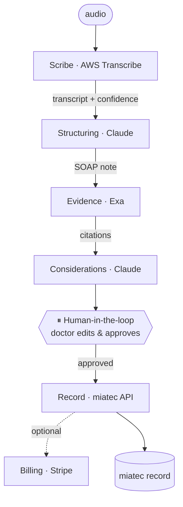

# miatec copilot

**The doctor just talks.** A team of agents transcribes the consultation, structures it into a clinical
note, grounds it in real evidence, ranks differential considerations, pauses for the doctor to
approve — then writes the finished record straight into **miatec**.

Built for the **NEXT Hackathon**. The bet: this rubric scores your *agents* — legible orchestration,
a real human-in-the-loop gate, real tool use (an actual EHR to write into), and explicit failure
handling. See [`NEXT_Hackathon_Build_Plan.md`](./NEXT_Hackathon_Build_Plan.md) for the full runbook.

> ⚕️ Decision **support**, not autonomous diagnosis. The agents rank considerations and draft the
> note; the clinician edits, approves, and owns every write into miatec.

---

## The loop

1. **Scribe** listens and transcribes — diarized, with per-segment confidence.
2. **Structuring** turns the transcript into a validated SOAP note.
3. **Evidence** grounds it with cited guidelines/literature (Exa).
4. **Considerations** ranks differential considerations with rationale + evidence links.
5. **⏸ Human-in-the-loop** — the doctor reviews, edits, dismisses, approves.
6. **Record** writes the approved note into miatec.
7. **Billing** *(optional)* issues a Stripe invoice.

## Architecture



| Agent | Job | Real tool/API | Scores under |
|---|---|---|---|
| **Scribe** | audio → diarized transcript w/ confidence | AWS Transcribe (pt-BR) | Actions & Tool Use |
| **Structuring** | transcript → validated SOAP JSON | Claude (tool-calling) | Autonomy & Decision-Making |
| **Evidence** | symptoms → cited guidelines | **Exa** | Tool Use + Exa prize |
| **Considerations** | note + evidence → ranked differentials | Claude (reasoning) | Autonomy & Decision-Making |
| **Record** | approved note → into miatec | **miatec API** | Actions & Tool Use — *the moat* |
| **Billing** *(opt)* | encounter → invoice | **Stripe** | Tool Use + Stripe prize |
| **Orchestrator** | order, state, HITL gate, failures | LangGraph | Orchestration + Failure Handling |

## Repo layout

```
.
├── backend/            FastAPI + LangGraph — agent orchestration + REST/SSE API
│   └── app/
│       ├── agents/     one file per agent (all stubbed, runnable)
│       ├── graph.py    the orchestration graph (screenshot this for the slide)
│       ├── schema.py   typed clinical-note + encounter-state contract
│       ├── events.py   in-memory SSE pub/sub
│       └── main.py     REST + SSE endpoints + the HITL gate
├── frontend/           Next.js + Tailwind — the doctor cockpit (live SSE)
│   └── src/
│       ├── app/page.tsx  the cockpit
│       └── lib/api.ts    typed backend client
├── .env.example        all sponsor keys in one place
└── NEXT_Hackathon_Build_Plan.md
```

## Quickstart

The whole loop runs with **zero API keys** — every agent ships a stub returning canned pt-BR data.

### 1 · Backend (port 8000)
```bash
cd backend
python3 -m venv .venv && source .venv/bin/activate
pip install -r requirements.txt
uvicorn app.main:app --reload --port 8000
```
Interactive API docs: http://localhost:8000/docs

### 2 · Frontend (port 3000)
```bash
cd frontend
cp .env.local.example .env.local      # points the cockpit at the backend
npm install                           # (already installed if you scaffolded here)
npm run dev
```
Open http://localhost:3000 → **Start consultation** → watch the agents light up → edit the note,
dismiss a consideration → **Approve & Write to miatec**.

## Wiring the real APIs

Replace the stubs incrementally — search the codebase for **`TODO(real)`**:

| Agent file | Real integration |
|---|---|
| `backend/app/agents/scribe.py` | AWS Transcribe (pt-BR, speaker labels) |
| `backend/app/agents/structuring.py` | Claude tool-calling + Pydantic validation |
| `backend/app/agents/evidence.py` | Exa `search` + `get_contents` |
| `backend/app/agents/considerations.py` | Claude reasoning over note + evidence |
| `backend/app/agents/record.py` | miatec REST (idempotency key + retry) |
| `backend/app/agents/billing.py` | Stripe (optional) |

Keys live in `.env` (copy from `.env.example`). The backend loads them via `python-dotenv`.

## How it maps to the rubric

| Judging dimension | Where it's earned |
|---|---|
| **Agent Overview** | 6 agents + orchestrator, one file each (`backend/app/agents/`) |
| **Autonomy & Decision-Making** | Structuring maps fields; Considerations ranks differentials |
| **Actions & Tool Use** | Transcribe, Exa, **miatec write**, Stripe — real APIs |
| **Orchestration** | the LangGraph graph in `graph.py` — show state flow |
| **Human-in-the-Loop** | `/approve` gate; nothing writes until the doctor approves |
| **Failure Handling** | low-confidence flags, "no strong evidence found", miatec write-retry |
| **Demo & Presentation** | the live cockpit (SSE) records well |

Three failure-handling beats are already wired into the stubs: a low-confidence transcript segment
(flagged red in the cockpit), an Evidence "no strong evidence found" path, and a Record retry loop.

## Deploy

- **Frontend → Vercel:** `vercel` from `frontend/`; set `NEXT_PUBLIC_API_URL` to the backend URL.
- **Backend → AWS:** containerize `backend/` and ship to App Runner / ECS Fargate. Smoke-test a
  hello-world deploy early (Day 1 night), not at 4pm Day 2.

## Notes

- Targets **Python 3.9+** so it runs as-is; the build plan recommends 3.12 for the deploy image.
- **In-memory** session store — fine for the demo; swap for Redis/Postgres for multi-process.
- **CORS** is wide open for the demo; lock it to `FRONTEND_ORIGIN` before anything real.
- This repo is **private** during the build — flip to public (or grant judge access) at submission.
