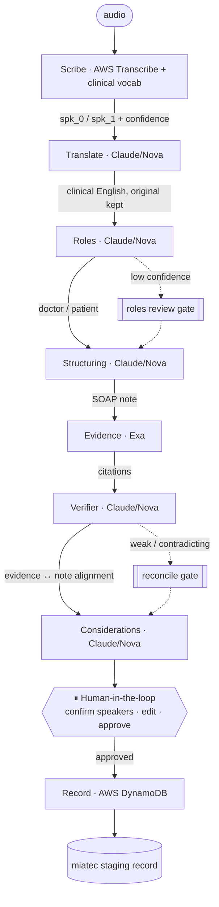

# miatec copilot

**The doctor just talks.** A team of agents transcribes the consultation (pt-BR), translates it into
clinical English (the original stays one toggle away), attributes each turn to doctor or patient,
structures it into a clinical note, grounds it in real evidence, checks that the evidence actually
supports the note, ranks differential considerations, pauses for the doctor to approve — then performs
the real write: the approved encounter lands in the **miatec staging store** (an idempotency-keyed
**AWS DynamoDB** write; entry into the miatec app follows from the staged record).

Built for the **NEXT Hackathon**. The bet: this rubric scores your *agents* — legible orchestration, a
real human-in-the-loop gate, real tool use (real APIs taking real actions), and explicit failure
handling. See [`NEXT_Hackathon_Build_Plan.md`](./NEXT_Hackathon_Build_Plan.md) for the runbook,
[`docs/INTEGRATIONS.md`](docs/INTEGRATIONS.md) for the live stack, and
[`docs/SPEAKER_ATTRIBUTION.md`](docs/SPEAKER_ATTRIBUTION.md) for the speaker-roles design.

> ⚕️ Decision **support**, not autonomous diagnosis. The agents draft and rank; the clinician edits,
> approves, and owns every write into miatec.

---

## The loop

1. **Scribe** transcribes the consultation — diarized (spk_0 / spk_1), with per-segment confidence.
2. **Translate** normalizes the pt-BR transcript into clinical English — every turn keeps its original (`text` / `text_en`), and the cockpit replays the rewrite as a cascading wave with an EN ⇄ PT toggle.
3. **Roles** attributes each speaker to **doctor or patient** — a reasoned step with a confidence score.
4. **Structuring** turns the role-labeled transcript into a validated SOAP note (English).
5. **Evidence** grounds it with cited guidelines/literature (Exa, English query → international sources).
6. **Verifier** cross-checks that the evidence actually supports the note's assessment — low alignment routes a conditional branch and makes the next step hedge.
7. **Considerations** ranks differential considerations with rationale + evidence links.
8. **⏸ Human-in-the-loop** — the doctor confirms speakers, edits, dismisses, approves.
9. **Record** writes the approved encounter to the **miatec staging store** (DynamoDB) — a conditional, idempotency-keyed put: safe to retry, writes once.

## Architecture

One compiled LangGraph `StateGraph` (native `interrupt()` + checkpointer) with **two confidence-gated
conditional edges** — routing on the agents' own confidence/alignment scores, so the system asks for
help exactly when it's unsure.



| Agent | Job | Real tool/API | Scores under |
|---|---|---|---|
| **Scribe** | audio → diarized transcript w/ confidence | AWS Transcribe (pt-BR) | Actions & Tool Use |
| **Translate** | pt-BR transcript → clinical English (original preserved) | Claude / Nova (AI Gateway → Bedrock) | Actions & Tool Use |
| **Roles** | diarized speakers → doctor/patient + confidence | Claude / Nova (AI Gateway → Bedrock) | Autonomy + Failure Handling |
| **Structuring** | transcript → validated SOAP JSON | Claude / Nova (AI Gateway → Bedrock) | Autonomy & Decision-Making |
| **Evidence** | symptoms → cited guidelines | **Exa** | Tool Use + Exa prize |
| **Verifier** | does the evidence support the note? → alignment + caution | Claude / Nova (AI Gateway → Bedrock) | Autonomy + Failure Handling |
| **Considerations** | note + evidence → ranked differentials | Claude / Nova (AI Gateway → Bedrock) | Autonomy & Decision-Making |
| **Record** | approved note → miatec staging store | **AWS DynamoDB** (idempotency-keyed) | Actions & Tool Use — *the real write* |
| **Orchestrator** | one StateGraph, native interrupt, two conditional gates, state, failures | LangGraph | Orchestration + Failure Handling |

> **LLM note:** Translate / Roles / Structuring / Verifier / Considerations share one interface (`backend/app/llm.py`)
> that falls through **Vercel AI Gateway** (Claude, `GATEWAY_MODEL`) → direct **Anthropic API** → **Amazon
> Nova** via Bedrock Converse → stub — on missing keys *and* on runtime failure. The deployed stack serves
> **Claude Sonnet 4.6 through the Gateway** with Nova as the resilience net (the workshop AWS account only
> allows Amazon models on Bedrock). Details in [`docs/INTEGRATIONS.md`](docs/INTEGRATIONS.md).

## Repo layout

```
.
├── backend/            FastAPI + LangGraph — agent orchestration + REST/SSE API
│   ├── Dockerfile      deploy image (Python 3.12, non-root, single worker) — what runs on ECS Fargate
│   └── app/
│       ├── agents/     one file per agent: scribe, translator, roles, structuring, evidence, verifier, considerations, record
│       ├── graph.py    the single orchestration graph — interrupt() + 2 conditional gates (screenshot for the slide)
│       ├── llm.py      one LLM interface — Vercel AI Gateway → Anthropic API → Bedrock Nova → stub
│       ├── aws.py      lazy boto3 clients (Transcribe, S3, Bedrock)
│       ├── vocab.py    pt-BR clinical custom vocabulary for Transcribe (provision: python -m app.vocab)
│       ├── retry.py    visible-retry wrapper for LLM/Exa calls
│       ├── schema.py   typed clinical-note + encounter-state contract
│       ├── events.py   in-memory SSE pub/sub
│       └── main.py     REST + SSE endpoints + the HITL gates (/roles, /approve)
├── frontend/           Next.js + Tailwind — "Control Room" cockpit (live SSE)
│   ├── src/app/page.tsx       the whole system on one screen: SSE wiring + HITL actions + always-on panels
│   ├── src/lib/stage.ts       useStageDirector — focus pacing + live rubric-scorecard accumulation
│   ├── src/lib/rubric.ts      per-agent → judging-dimension mapping (the on-screen scorecard)
│   └── src/components/        FlowGraph (the live LangGraph) · Panel · RubricStrip · workSurfaces · ScorecardOverlay
├── docs/               INTEGRATIONS.md (live stack) · SPEAKER_ATTRIBUTION.md (roles design)
├── .env.example        all sponsor keys in one place
└── NEXT_Hackathon_Build_Plan.md
```

## Quickstart

The whole loop runs with **zero API keys** — every agent has a stub fallback returning canned pt-BR data.

### 1 · Backend (port 8000)
```bash
cd backend
python3 -m venv .venv && source .venv/bin/activate
pip install -r requirements.txt
cp ../.env.example ../.env      # add keys to light up the real agents (see docs/INTEGRATIONS.md)
uvicorn app.main:app --reload --port 8000
```

### 2 · Frontend (port 3000)
```bash
cd frontend
cp .env.local.example .env.local
npm install
npm run dev
```
Open http://localhost:3000 → **Start consultation** → watch the agents light up → confirm/swap
speakers, edit the note, dismiss a consideration → **Approve & Write to miatec**.

## The agents — all real, each with a stub fallback

| Agent file | Live integration |
|---|---|
| `agents/scribe.py` | AWS Transcribe batch (pt-BR, diarization) — validated on a real consult |
| `agents/translator.py` | Claude/Nova batch translation pt-BR → clinical English; cached per transcript; original kept |
| `agents/roles.py` | Claude/Nova role attribution + confidence; HITL confirm/swap (`POST /roles`) |
| `agents/structuring.py` | Claude/Nova strict-JSON SOAP, Pydantic-validated |
| `agents/evidence.py` | Exa `search_and_contents` — real guideline citations |
| `agents/verifier.py` | Claude/Nova evidence↔note alignment check; low alignment → caution branch |
| `agents/considerations.py` | Claude/Nova ranked differentials (hedges on low alignment) |
| `agents/record.py` | **AWS DynamoDB** conditional put — idempotency key as partition key, retries can't double-write (provision: `scripts/provision_miatec_table.sh`) |

If a key/credential is missing, that agent silently uses its stub, so the cockpit demo never breaks.

## How it maps to the rubric

| Judging dimension | Where it's earned |
|---|---|
| **Agent Overview** | 8 agents + orchestrator, one file each (`backend/app/agents/`) |
| **Autonomy & Decision-Making** | Roles attributes speakers; Structuring maps fields; **Verifier** self-checks evidence↔note alignment; Considerations ranks differentials |
| **Actions & Tool Use** | AWS Transcribe (+ clinical vocab), Claude via the Vercel AI Gateway (Nova fallback), Exa, **AWS DynamoDB** (the miatec staging write) — real APIs taking real actions |
| **Orchestration** | one `StateGraph` in `graph.py` — native `interrupt()` + checkpointer + **two confidence-driven gates** (roles, verifier) |
| **Human-in-the-Loop** | `/roles` speaker confirm/swap + `/approve` gate; nothing writes until the doctor approves |
| **Failure Handling** | low-confidence transcript masking, low-confidence role → review, **verifier caution branch**, visible retries, "no strong evidence found", write-gate validation |
| **Demo & Presentation** | the live cockpit (SSE) — every agent narrates its step + decision; records well |

Failure-handling beats already wired into the live system: low-confidence transcript segments masked
before structuring, a low-confidence **role** assignment routed to the human gate, the **Verifier**
catching evidence that doesn't support the note (→ Considerations hedge), visible LLM/Exa retries, and
Evidence returning "no strong evidence found" instead of a hallucinated citation.

## Deploy — live

The demo stack is deployed and verified end-to-end (a live `/ingest` → real Transcribe → Claude via the
Gateway → SSE into the cockpit):

- **Backend → AWS ECS Fargate** (`us-west-2`, cluster `miatec`, service `miatec-copilot`): the
  `backend/Dockerfile` image behind an ALB, with **CloudFront** in front for HTTPS —
  **https://d1g2v6wxyaxkjl.cloudfront.net** (= the frontend's `NEXT_PUBLIC_API_URL`; try `/health`).
  Transcribe/S3/DynamoDB run on the task role; `AI_GATEWAY_API_KEY` / `EXA_API_KEY` are injected from
  Secrets Manager. Keep **one task, one uvicorn worker** — the checkpointer and SSE bus are in-process.
- **LLM → Vercel AI Gateway** (`GATEWAY_MODEL=anthropic/claude-sonnet-4.6`), falling through to the
  direct Anthropic API and then Bedrock Nova — a provider failure degrades, it doesn't break.
- **Frontend → Vercel:** live at **https://frontend-jose-fortunatos-projects.vercel.app**
  (`NEXT_PUBLIC_API_URL` → the CloudFront URL). Redeploy: `vercel --prod` from `frontend/`.
- **miatec staging store → DynamoDB** (`miatec-encounters`): provision once with
  `scripts/provision_miatec_table.sh` (table + task-role policy + task-def env var).
- **Redeploy backend:** `scripts/redeploy_backend.sh` (linux/amd64 build → ECR →
  `--force-new-deployment` → wait stable). A fresh task starts with a **cold Scribe cache** — run one
  consultation to warm it before demoing.

Full topology, the why (CloudFront vs App Runner, non-blocking `/ingest`) and the gotchas:
[`docs/INTEGRATIONS.md`](docs/INTEGRATIONS.md).

## Notes

- Targets **Python 3.9+** locally; the deploy image (`backend/Dockerfile`) runs **3.12**.
- **In-memory** session store + SSE bus — the reason the deployed service pins one task / one worker;
  swap for Redis/Postgres before scaling out.
- **CORS** is wide open for the demo; lock it to `FRONTEND_ORIGIN` before anything real.
- Repo is **private** during the build — flip to public (or grant judge access) at submission.
